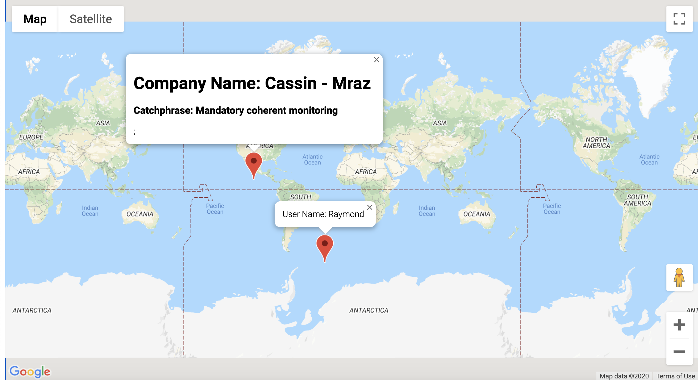

# Maps TypeScript 
* Randomly generate a user and company

# Learning Goals
* Learn how to build an application with TypeScript
* Understand how to effectively use TypeScript inside an application
* Learn how to use and Manipulate Google Maps API

# Technologies Used 
* TypeScript
* CSS3
* HTML5
* Google Maps API

# API Reference
* This project was built using [Google Maps API](https://developers.google.com/maps/documentation/javascript/get-api-key)

# Credit
This site was built using [Typescript: The Complete Developer's Guide](https://www.udemy.com/course/typescript-the-complete-developers-guide/)

